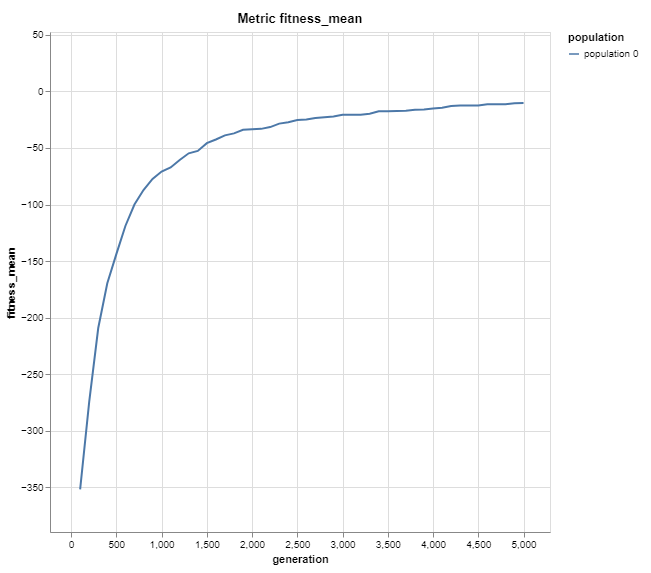

# Implemented algorithms

##  Whale Optimisation Results

### CPU with diagrams

──── Summary ────

Total time: 506.031s
Populations: 1
Population time (mean): 506.025s
Generations (mean): 5000

──── Best individual ────

Fitness: -0.0
Generation: 1208
Genome: #Nx.Tensor
f64[100]
[6.580485527915871e-11, 4.97028886930065e-13, -1.3560884760564342e-11, -2.4274446422473243e-10, 1.4371060951485401e-11, 6.945642178469022e-13, -7.881858252364167e-12, -1.2750534433582928e-9, -1.0741518588787144e-11, 1.2349778864672447e-10, -5.511851598657829e-12, -1.8806548543653903e-11, 1.8386075942449126e-10, 2.6017196997406937e-10, -3.525600899488138e-11, -7.737889641724311e-11, 1.4521664119011615e-11, -4.2653962396388855e-10, 1.4073470826421327e-10, 5.0916517966296846e-11, -1.6586273278500815e-9, -4.1978331594113e-10, 1.0648884273647863e-11, 6.10763180602434e-10, -6.883878789793953e-13, -4.1665310633411504e-12, 4.660745571603929e-13, -4.483294170647765e-12, -2.1258181526379888e-10, -3.5402323422169747e-12, 4.0722320165824365e-11, 1.1145220149693756e-11, -1.2104155001139204e-10, -5.266699407211477e-12, 8.198924739975776e-11, -5.270892187300627e-10, -1.3298213617812257e-10, -1.130364483078062e-9, -6.432842976591974e-11, 7.12847621611147e-12, -3.0928091096567003e-11, -6.810952021651635e-11, 3.426429487262396e-12, 2.024551062659995e-13, -2.6455125350997903e-10, -7.904715413358552e-10, -2.660170675236004e-10, 2.5291084056190134e-10, -2.201195064939177e-11, -9.384362111123165e-13, ...]

### GPU

──── Summary ────

Total time: 8.113s
Populations: 1
Population time (mean): 7.647s
Generations (mean): 5000

──── Best individual ────

Fitness: -0.0
Generation: 1106
Genome: #Nx.Tensor
f64[100]
[-3.309206289738269e-10, -4.729313503715076e-11, -9.323912223978144e-11, -8.301367749459624e-11, -1.6290525329975183e-12, -2.5699955060952612e-11, -5.806680787362156e-13, 6.921580244167279e-11, 5.925835176875484e-10, 9.521188845365522e-11, -2.928572133296362e-13, 3.38934009066652e-13, 5.531636706570867e-12, -3.923728329532196e-12, 6.963929893612332e-11, -3.180874497053898e-13, -1.0429565656441984e-10, -8.735676342010759e-11, 1.5905815553014385e-10, -1.247164860243272e-10, 5.618810314785986e-13, -3.017042544147028e-11, -1.5580523082404578e-10, -2.2592937753134262e-11, 1.326746983141322e-12, 9.235876883179788e-12, -4.3879031795277695e-12, 2.8638142858470042e-11, -1.016986902212941e-10, 5.1770645404909e-12, 7.00197865387722e-12, -1.4049149108745927e-16, -8.738517327472102e-12, -5.582287726245337e-10, -4.8398919057049514e-11, 3.4735262013804532e-12, -2.21447182064662e-11, 1.0919025719466794e-11, 1.1573642412811545e-10, -1.705348059382007e-11, -8.884331939599263e-13, 7.194386174190234e-11, -2.6328444777733508e-11, -1.3994321695372478e-10, -4.903324169732252e-12, -4.562110764841716e-15, 4.254724110452601e-10, 3.772248399745787e-12, -8.299430408299979e-10, -1.2472506602820456e-12, ...]

──── Summary ────

Total time: 3.448s
Populations: 1
Population time (mean): 2.956s
Generations (mean): 1500

──── Best individual ────

Fitness: -0.0
Generation: 449
Genome: #Nx.Tensor
f64[100]
[-6.6057159969864736e-12, -8.7087564214738e-11, -1.1491836647138486e-12, 7.324775417499517e-12, 7.459757081423261e-11, -6.27703478248862e-11, 1.868973309384483e-10, 1.0326433041557222e-10, 7.260312981012601e-12, -1.4215040691626167e-10, -6.052595373879239e-11, 1.528699211494671e-10, 4.7098133251191874e-11, -3.1998102839823133e-11, -8.495712841799289e-10, -1.787531911786831e-10, -1.5943381191483412e-10, -5.850120160311963e-11, 4.1816907493615523e-10, 1.5881030475885344e-10, 1.7312999288536794e-11, 5.121003809411965e-10, 5.3169243936108064e-11, 1.0348989182037423e-9, -3.833772665111839e-11, 4.353233115166992e-10, 2.3535153956214875e-10, 4.487226295675051e-10, -1.3184237670300122e-10, -8.94432537329906e-11, 1.0983275596377976e-10, -8.805157952760154e-11, -1.3979408636666333e-11, -1.5900719286739486e-10, 8.791942125128729e-12, -7.097289372552398e-13, -2.0184587509632522e-11, 1.9438084640350554e-11, -2.694729639625513e-12, 1.4497554678282016e-10, 2.744539628174291e-11, 1.3550890261765223e-10, -1.6914067032876804e-10, 1.7888038979752707e-12, -4.693718244270161e-12, -1.1514267981958767e-9, 5.062896858302503e-11, 8.665194251907988e-10, -4.786998494357236e-10, -3.061804845884943e-10, ...]

## Symbiotic algorithm

### CPU with diagrams

──── Summary ────

Total time: 286.93s
Populations: 1
Population time (mean): 286.873s
Generations (mean): 5000

──── Best individual ────

Fitness: -12.777534499277456
Generation: 4768
Genome: #Nx.Tensor
f64[100]
[-0.015224253758788109, 0.009341123513877392, -0.006388271693140268, 0.033668193966150284, -0.003250659676268697, -0.0037055336870253086, -0.01125724174601661, 0.010667266324162483, 0.013438262045383453, -0.00559206772595644, -0.026604436337947845, 0.002918244106695056, 0.0041006579995155334, -0.05776491388678551, -0.030730603262782097, 1.5151678235270083e-4, 0.0033370007295161486, -0.004548664204776287, -0.004799603018909693, 0.04125794768333435, -0.02179439179599285, 8.370768773602322e-5, 0.0359947569668293, -0.9766104817390442, 0.0035406528040766716, 0.004716034512966871, 1.007156491279602, -0.009555446915328503, -0.022173061966896057, 0.01262687984853983, -0.0076486472971737385, 0.006182161159813404, -0.008527733385562897, 0.004085998050868511, 0.03263796865940094, -0.013549361377954483, -0.003896735508572391, -0.0030478346161544323, -0.003927776589989662, 0.051876720041036606, 0.003403661772608757, -0.04565364494919777, 0.0164803434163332, -0.036993928253650665, 0.003925231751054525, 0.9989215288310378, 0.02080618217587471, -0.005710876081138849, -0.028237447142601013, -0.03235260397195816, ...]

### GPU

──── Summary ────

Total time: 9.206s
Populations: 1
Population time (mean): 8.731s
Generations (mean): 5000

## Conclusion

GPU runs are much faster as expected. Symbiotic algorithm is approximately 33 times faster and Whale optimisation is 66 times faster. The algorithms give good results. Whale finds the best individual already after 25-35% of entire time of algorithm and it is dependent on number of iterations. Symbiotic steadily improves fitness and has the best metrics at the end.

## Comparision with other languages

Unfortunately, despite searching, we did not find any implementaions suitable for GPU in the most popular languages (we were looking mainly for python implementation). The popularity of the algorithms we implemented may be the reason.